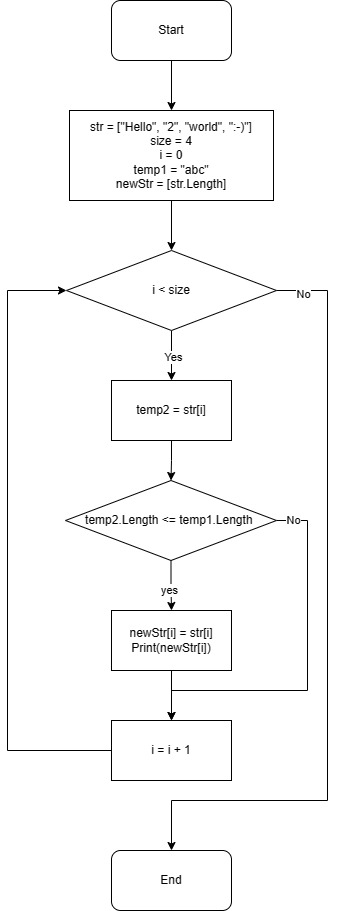

# Контрольная работа #
## *Создаем репозиторий в Github*:
1. Необходимо зайти на сайт github.com и авторизоваться;
2. В правом верхнем углу нажать кнопку "Greate new" и в высвитевшемся окне выбрать "New repozitory";
3. Необходимо в github назвать новый репозиторий (имя может совпадать с локальным репозиторием)
4. Открыть локальный репозиторий в VS code и переименовать ветку master на ветку main, введя команду:
```sh
git branch -m main
```
5. Добавляем удаленный репозиторий вводом команды в терминал VS code:
```sh
git remote add origin "URL-адрес"
```
## *Добавляем файл README*:
1. Добавляем первый файл "README.md", вводим команду:
```sh
git add README.md
```
2. Создаем первый коммит, вводим команду:
```sh
git commit -m "Add README"
```
## *Создаем алгоритм решения задачи в виде блок-схемы*:

## *Решаем задачу на языке C#*:
1. Создаем произвольный массив строк;
2. Создаем переменную temp1 типа "string", которой присваем значение не более 3-х произвольных символов;  
3. Создаем новый массив, размером равным первоначальному;
4. Запускаем цикл, где проверяем не вышли ли мы за пределы массива;
5. Если мы находимся в массиве, то создаем переменную temp2 и присваиваем ей значение первой строки в массиве;
6. Проверяем строку (temp2) на количество символов путем сравнения ее с переменной temp1;
7. Если условие соблюдается то закладываем текущую строку в новый массив;
8. Выводим значение на экран;
9. Увеличиваем счетчик на 1;
10. Возвращаемся в тело цикла и проводим все теже действия, пока счетчик не будет равен количеству строк в массиве;
11. Когда счетчик будет равен количеству строк в массиве - завершаем программу.

## *Загружаем локальный репозиторий в Github, вводом команды*:
```sh
git push -u origin main
```

